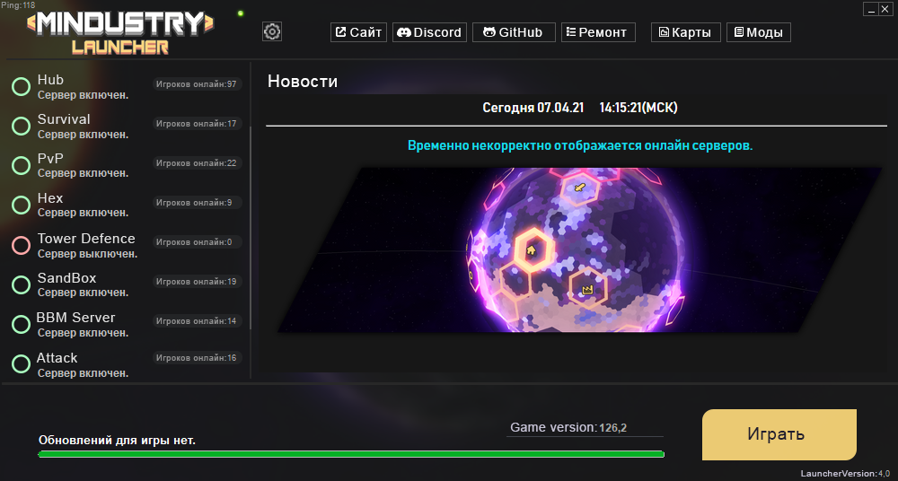

 
  
ENG Description

  
- Client auto-update
- Time\Date\IP\News
- Online server display
- Displaying server status (Enabled / Disabled)
- Buttons (Site\Discord\GitHub\Client/Launcher Repair\Maps\Mods
- Display ping to servers
  
For all questions, write to Discord: https://ds.easyplay.su/

  

 
  
RUS Description

  
- Автообновление клиента
- Время\Дата\IP\Новости
- Отображение онлайна сервера
- Отображение статуса сервера(Включен\Выключен)
- Кнопки (Сайт\Discord\GitHub\Ремонт клиента/лаунчера\Карты\Моды
- Отображение пинга до серверов

По всем вопросам пишите в Discord: https://ds.easyplay.su/

  

# Developers
- [EasyPlaySu](https://github.com/EasyPlaySu) (Head Developer)

# Helpers
- [Fatonndev](https://github.com/Fatonndev)
- [MemFaceGo](https://github.com/MemFaceGo)

# Discord Server Banner
